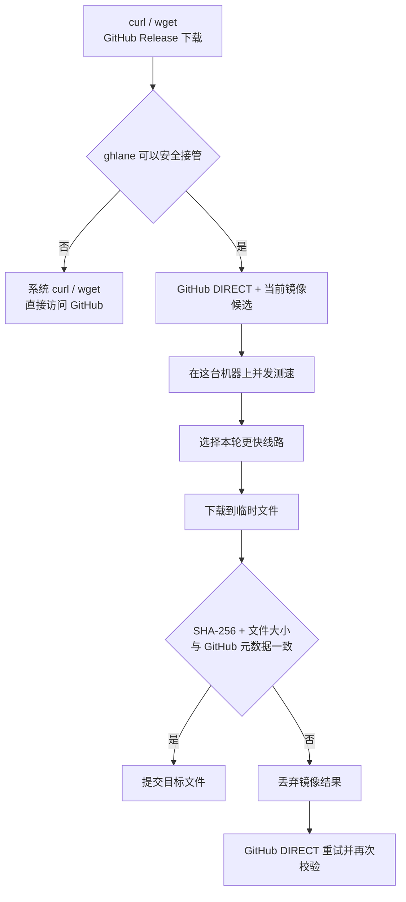

# ghlane

**给中国大陆 Linux 主机 / VPS 的 GitHub Release 自动加速器**

[](https://github.com/Takabunbin/ghlane/actions/workflows/test.yml)
[](https://github.com/Takabunbin/ghlane)
[](https://github.com/Takabunbin/ghlane)
[](LICENSE)

如果你的 Linux 服务器用 `curl` 或 `wget` 下载 GitHub Release 经常很慢、卡住或超时，安装 ghlane 一次即可。之后继续使用原来的 GitHub URL 和原来的下载命令。

ghlane 会在**当前这台机器**上测试 GitHub DIRECT 和可用镜像，选择本轮更快的线路。下载完成后，它再用 GitHub Releases API 提供的 SHA-256 和文件大小校验文件。

**适合：** 中国大陆 Linux VPS、云服务器、软路由或其他经常从 GitHub Releases 拉取二进制文件的 Linux 主机。

**当前不处理：** `git clone`、GitHub API、Raw 文件、archive/codeload、私有 Release。

## 快速开始

安装：

```bash
curl -fsSL https://cdn.jsdelivr.net/gh/Takabunbin/ghlane@main/install.sh | bash
```

安装后继续用原来的命令：

```bash
curl -fL   https://github.com/OWNER/REPO/releases/download/TAG/FILE   -o FILE
```

或者：

```bash
wget   https://github.com/OWNER/REPO/releases/download/TAG/FILE   -O FILE
```

你不需要把 GitHub URL 手工改成某个镜像前缀。

查看当前状态：

```bash
ghlane status
```

## 工作原理



选路发生在你的机器上。不同 VPS、运营商和时间段可能得到不同结果。ghlane 默认缓存一次选路结果，避免每次下载都重新测速。

## 镜像池

ghlane 从人工种子和公开社区来源收集候选镜像。GitHub Actions 会先检查候选是否能正确返回 GitHub Release 样本，再生成版本化的 `registry-v1`。

中央检查只决定哪些节点可以进入候选池。客户端仍会在本机比较 DIRECT 和当前候选。

查看候选：

```bash
ghlane mirrors
```

排查选路时，可以对一个具体 Release URL 查看本机测速结果：

```bash
ghlane benchmark https://github.com/OWNER/REPO/releases/download/TAG/FILE
```

`benchmark` 是诊断命令，日常下载不需要运行。

## 下载完整性

ghlane 把公共镜像当作不可信传输层。

符合加速条件的下载会先进入临时文件。ghlane 从 GitHub Releases API 获取该 asset 的 SHA-256 和文件大小，校验一致后才提交目标文件。

镜像返回错误内容、异常响应或下载失败时，ghlane 会丢弃临时结果，并尝试 GitHub DIRECT。

以下情况直接交给系统 `curl` / `wget`：

| 情况 | 处理 |
| --- | --- |
| Authorization、Cookie、referer、代理或 TLS 覆盖参数 | DIRECT |
| `.netrc`、用户 curlrc / wgetrc 或影响 HTTPS 的系统配置 | DIRECT |
| 未知的 curl / wget 参数 | DIRECT |
| Range、断点续传、remote-name 等部分文件语义 | DIRECT |
| 多个 URL | DIRECT |
| 输出文件已经存在 | DIRECT |
| GitHub 没有提供可验证的 Release digest | DIRECT |
| Python 3 或 SHA-256 工具不可用 | DIRECT |

安全边界和信任模型见 [SECURITY.md](SECURITY.md)。

## 支持范围

ghlane 当前加速这一类地址：

```text
https://github.com/<owner>/<repo>/releases/download/<tag>/<asset>
```

| 请求 | 处理 |
| --- | --- |
| 公开 GitHub Release asset | 符合安全条件时参与选路 |
| GitHub API | DIRECT |
| `raw.githubusercontent.com` | DIRECT |
| archive / codeload | DIRECT |
| `git clone` / fetch / push | 不接管 |
| 私有 Release | DIRECT |
| 带 query 或 fragment 的 Release URL | DIRECT |

## 命令

| 命令 | 用途 |
| --- | --- |
| `ghlane status` | 查看后端、registry 和缓存线路 |
| `ghlane mirrors` | 查看 DIRECT 与当前镜像候选 |
| `ghlane benchmark URL` | 排查时查看当前机器的线路测速 |
| `ghlane refresh` | 刷新 registry 并清除选路缓存 |
| `ghlane self-test` | 检查本地核心规则 |
| `ghlane version` | 输出版本 |

临时跳过 ghlane：

```bash
GHLANE_BYPASS=1 curl -fL URL -o FILE
```

## 已验证系统

CI 当前覆盖：

| 系统 | 状态 |
| --- | --- |
| Debian 12 | 通过 |
| Debian 13 | 通过 |
| Ubuntu 24.04 | 通过 |
| Ubuntu 26.04 | 通过 |

加速路径需要 Bash、curl、Python 3 和 `sha256sum`。使用 wget 加速时还需要 wget。

<details>
<summary><strong>配置</strong></summary>

安装器写入：

```text
/etc/ghlane.conf
```

| 变量 | 默认值 | 作用 |
| --- | ---: | --- |
| `REAL_CURL` | `/usr/bin/curl` | 系统 curl 后端 |
| `REAL_WGET` | `/usr/bin/wget` | 系统 wget 后端 |
| `MIRROR_FILE` | `/etc/ghlane/mirrors.txt` | 本地 fallback 镜像列表 |
| `BEST_TTL` | `3600` | 选路缓存秒数 |
| `RACE_TIMEOUT` | `2` | 单个候选的测速窗口秒数 |
| `REGISTRY_URL` | 官方 `registry-v1.txt` | 远程镜像列表 |
| `REGISTRY_TTL` | `86400` | registry 缓存秒数 |
| `REGISTRY_MAX` | `8` | 客户端接受的镜像数量上限 |
| `REGISTRY_TIMEOUT` | `5` | registry 请求超时秒数 |

关闭远程 registry：

```bash
REGISTRY_URL=''
```

关闭后仍可使用本地 fallback 和 DIRECT。

重新安装会保留已有配置，并迁移旧版官方 registry URL。安装器不会覆盖已有的 `/usr/local/bin/curl` 或 `/usr/local/bin/wget`。

</details>

<details>
<summary><strong>安装后的文件</strong></summary>

```text
/usr/local/libexec/ghlane
/usr/local/bin/ghlane
/usr/local/bin/curl
/usr/local/bin/wget
/etc/ghlane.conf
/etc/ghlane/mirrors.txt
```

`/usr/local/bin/curl` 和 `/usr/local/bin/wget` 只在对应路径可安全接管时创建为指向 ghlane 的符号链接。系统 curl / wget 保留在原位置。

</details>

## 卸载

```bash
curl -fsSL https://cdn.jsdelivr.net/gh/Takabunbin/ghlane@main/uninstall.sh | bash
```

卸载器只删除 ghlane 创建的 wrapper、核心文件和配置，不删除系统 `curl` 或 `wget`。

<details>
<summary><strong>开发与测试</strong></summary>

```bash
bash -n ghlane install.sh uninstall.sh
shellcheck ghlane install.sh uninstall.sh scripts/build-registry.sh
./ghlane self-test

bash tests/fault-injection.sh
bash tests/registry.sh
bash tests/registry-health.sh
python3 tests/discovery.py
```

GitHub Actions 还会在 Debian 12/13、Ubuntu 24.04/26.04 上运行安装生命周期测试。

</details>

## 许可证

[MIT](LICENSE) © 2026 Takabunbin
