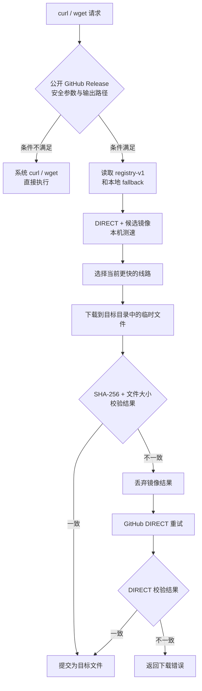
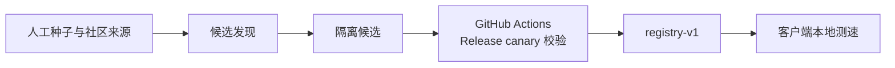

# ghlane

**Linux 上的 GitHub Release 透明加速器**

[](https://github.com/Takabunbin/ghlane/actions/workflows/test.yml)
[](https://github.com/Takabunbin/ghlane)
[](https://github.com/Takabunbin/ghlane)
[](LICENSE)

继续使用原来的 `curl` 和 `wget`。ghlane 在本机比较 GitHub DIRECT 与可用镜像，选择当前更快的线路，并用 GitHub Release 提供的 SHA-256 和文件大小检查最终文件。

```console
$ curl -fL \
  https://github.com/komari-monitor/komari/releases/download/1.5.0-fix1/komari-linux-amd64 \
  -o komari-linux-amd64

[ghlane] selected gh-proxy.com
100 42.6M  100 42.6M    0     0  13.6M      0  0:00:03  0:00:03 --:--:-- 13.6M
```

上面的速度来自一次真实链路验收。实际速度取决于本机网络、GitHub 可达性和镜像状态，ghlane 会在你的机器上重新测速。

## 安装

```bash
curl -fsSL https://cdn.jsdelivr.net/gh/Takabunbin/ghlane@main/install.sh | bash
```

安装器会先把当前 `main` 解析成具体 commit，再从这个 commit 下载安装文件。非 root 用户需要系统提供 `sudo`。

安装后检查：

```bash
ghlane status
```

输出类似：

```text
ghlane 0.2.1
curl: /usr/bin/curl
wget: /usr/bin/wget
mirrors fallback: /etc/ghlane/mirrors.txt
registry: https://cdn.jsdelivr.net/gh/Takabunbin/ghlane@main/registry-v1.txt
registry cache: fresh
cached route: gh-proxy.com
```

## 使用

`curl`：

```bash
curl -fL   https://github.com/OWNER/REPO/releases/download/TAG/FILE   -o FILE
```

`wget`：

```bash
wget   https://github.com/OWNER/REPO/releases/download/TAG/FILE   -O FILE
```

不需要记镜像前缀，也不需要换一套下载命令。ghlane 只接管符合安全条件的 GitHub Release 下载，其他调用交给系统 `curl` 或 `wget`。

## 工作方式



客户端默认缓存一次选路结果 1 小时，远程 registry 默认缓存 24 小时。冷启动时，DIRECT 和候选镜像进入同一测速流程。

### Registry 更新



发现任务只收集候选。中央任务用固定 GitHub Release 样本检查协议和内容，再生成带版本头的 `registry-v1`。客户端仍会校验每个实际下载文件。

当前协议：

```text
# ghlane-registry-v1
https://mirror.example
```

registry 无法刷新时，ghlane 会继续使用可用缓存；没有可用缓存时，会回退到安装时的镜像列表和 DIRECT。

## 安全边界

**ghlane 不信任镜像返回的文件内容。**

镜像只负责传输。文件能否交给调用者，由 GitHub Releases API 返回的资产 `digest` 和 `size` 决定。

一次加速下载需要同时满足：

1. URL 指向公开的 `github.com/.../releases/download/...` 文件。
2. `curl` 或 `wget` 参数属于 ghlane 已审查的安全集合。
3. 命令指定一个尚不存在的输出文件。
4. GitHub Releases API 返回该文件的 SHA-256 和文件大小。
5. 下载结果与 GitHub 元数据一致。

ghlane 先把数据写入目标目录中的临时文件。校验通过后再提交为目标文件。镜像返回错误内容、超大响应或下载错误时，临时文件会被丢弃，并尝试 GitHub DIRECT。

这些情况直接绕过镜像：

| 情况 | 处理 |
| --- | --- |
| Authorization、Cookie、referer、代理或 TLS 覆盖参数 | DIRECT |
| `.netrc`、用户 curlrc / wgetrc 或影响 HTTPS 的系统配置 | DIRECT |
| 未知的 curl / wget 参数 | DIRECT |
| Range、断点续传、remote-name 等部分文件语义 | DIRECT |
| 多个 URL | DIRECT |
| 输出文件已经存在 | DIRECT |
| GitHub 没有提供可验证的 Release digest | DIRECT |
| Python 3 或 SHA-256 工具不可用 | DIRECT |

更完整的说明见 [SECURITY.md](SECURITY.md)。

## 支持范围

ghlane 当前处理：

```text
https://github.com/<owner>/<repo>/releases/download/<tag>/<asset>
```

这些请求不会进入镜像选路：

- GitHub API
- `raw.githubusercontent.com`
- repository archive / codeload
- `git clone`、fetch、push
- 私有 Release
- 带 query 或 fragment 的 Release URL
- ghlane 无法确认语义安全的 curl / wget 调用

ghlane 对这些请求不改写 URL。

### 已验证系统

CI 会在以下系统执行安装、重装、卸载和回归测试：

| 系统 | CI |
| --- | --- |
| Debian 12 | 通过 |
| Debian 13 | 通过 |
| Ubuntu 24.04 | 通过 |
| Ubuntu 26.04 | 通过 |

加速路径需要 Bash、curl、Python 3 和 `sha256sum`。使用 wget 加速时还需要 wget。

## 命令

| 命令 | 用途 |
| --- | --- |
| `ghlane status` | 查看后端、registry 状态和缓存线路 |
| `ghlane mirrors` | 查看 DIRECT 与当前候选镜像 |
| `ghlane refresh` | 刷新 `registry-v1` 并清除选路缓存 |
| `ghlane self-test` | 检查核心规则和本地安全前提 |
| `ghlane version` | 输出当前版本 |

临时跳过 ghlane：

```bash
GHLANE_BYPASS=1 curl -fL URL -o FILE
```

这个环境变量只影响当前命令。

## 配置

安装器写入：

```text
/etc/ghlane.conf
```

常用配置：

| 变量 | 默认值 | 作用 |
| --- | ---: | --- |
| `REAL_CURL` | `/usr/bin/curl` | 系统 curl 后端 |
| `REAL_WGET` | `/usr/bin/wget` | 系统 wget 后端 |
| `MIRROR_FILE` | `/etc/ghlane/mirrors.txt` | 本地 fallback 镜像列表 |
| `BEST_TTL` | `3600` | 选路缓存秒数 |
| `RACE_TIMEOUT` | `2` | 单个候选的测速窗口秒数 |
| `REGISTRY_URL` | 官方 `registry-v1.txt` | 远程镜像列表 |
| `REGISTRY_TTL` | `86400` | registry 缓存秒数 |
| `REGISTRY_MAX` | `8` | 客户端接受的镜像数量上限 |
| `REGISTRY_TIMEOUT` | `5` | registry 请求超时秒数 |

关闭远程 registry：

```bash
REGISTRY_URL=''
```

关闭后仍可使用本地 fallback 和 DIRECT。

重新安装会保留已有配置，并迁移旧版官方 registry URL。安装器不会覆盖用户已有的 `/usr/local/bin/curl` 或 `/usr/local/bin/wget`。

<details>
<summary>安装后的文件</summary>

```text
/usr/local/libexec/ghlane
/usr/local/bin/ghlane
/usr/local/bin/curl
/usr/local/bin/wget
/etc/ghlane.conf
/etc/ghlane/mirrors.txt
```

`/usr/local/bin/curl` 和 `/usr/local/bin/wget` 只在对应路径可安全接管时创建为指向 ghlane 的符号链接。系统后端保留在原位置。

</details>

## 卸载

```bash
curl -fsSL https://cdn.jsdelivr.net/gh/Takabunbin/ghlane@main/uninstall.sh | bash
```

卸载器只删除 ghlane 创建的 wrapper、核心文件和配置，不删除系统 `curl` 或 `wget`。

## 开发与测试

项目使用 ShellCheck、故障注入测试、registry 测试和四套发行版安装矩阵。GitHub Actions 会在 push 和 pull request 上运行这些检查。

本地快速检查：

```bash
bash -n ghlane install.sh uninstall.sh
shellcheck ghlane install.sh uninstall.sh scripts/build-registry.sh
./ghlane self-test
```

完整回归测试：

```bash
bash tests/fault-injection.sh
bash tests/registry.sh
bash tests/registry-health.sh
python3 tests/discovery.py
```

## 设计取舍

ghlane 只加速自己能验证命令语义和文件完整性的请求。无法确认时，原始命令交给 DIRECT。

客户端不运行 daemon 或 cron。registry 维护由仓库的 GitHub Actions 执行，用户机器只在需要下载时工作。

## 许可证

[MIT](LICENSE) © 2026 Takabunbin
