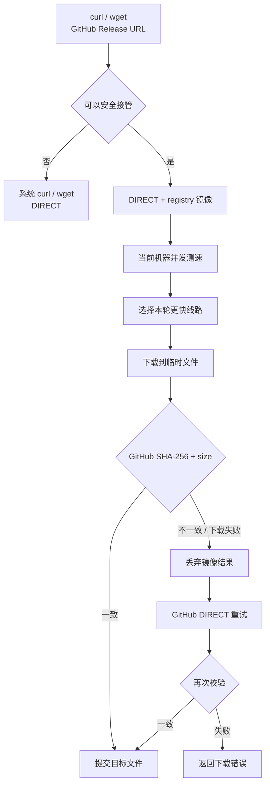

# ghlane

**给中国大陆 Linux 主机 / VPS 加速 GitHub Release 下载**

[](https://github.com/Takabunbin/ghlane/actions/workflows/test.yml)
[](https://github.com/Takabunbin/ghlane)
[](https://github.com/Takabunbin/ghlane)
[](LICENSE)

当 Linux 服务器直连 GitHub Release 较慢或不稳定时，ghlane 会在**这台机器上**比较 GitHub DIRECT 和多个可用镜像，选择本轮测速更快的线路。

装好以后：

- 不改 GitHub 下载链接
- 不记镜像前缀
- 不运行后台守护进程
- 继续使用原来的 `curl` 和 `wget`

ghlane 当前只处理公开的 GitHub Release 文件：

```text
https://github.com/<owner>/<repo>/releases/download/<tag>/<asset>
```

它不加速 `git clone`、GitHub API、Raw 文件、archive/codeload 或私有 Release，也不修改系统代理。

## 安装

```bash
curl -fsSL https://cdn.jsdelivr.net/gh/Takabunbin/ghlane@main/install.sh | bash
```

安装器会先把当前 `main` 解析成具体 commit，再下载安装文件。非 root 用户需要系统提供 `sudo`。

检查状态：

```bash
ghlane status
```

```text
ghlane 0.2.2
curl: /usr/bin/curl
wget: /usr/bin/wget
mirrors fallback: /etc/ghlane/mirrors.txt
registry: https://cdn.jsdelivr.net/gh/Takabunbin/ghlane@main/registry-v1.txt
registry cache: fresh
cached route: gh-proxy.com
```

## 它到底比较了哪些线路

正常下载时，ghlane 只打印最终选择，避免每次 `curl` 都输出整张测速表：

```console
$ curl -fL   https://github.com/komari-monitor/komari/releases/download/1.5.0-fix1/komari-linux-amd64   -o komari-linux-amd64

[ghlane] selected gh-proxy.com
100 42.6M  100 42.6M    0     0  13.6M      0  0:00:03  0:00:03 --:--:-- 13.6M
```

这段 13.6 MiB/s 来自一次真实下载验收，但它只说明**最终下载速度**，不能单独证明其他线路更慢。

要看完整对比，直接跑：

```bash
ghlane benchmark   https://github.com/komari-monitor/komari/releases/download/1.5.0-fix1/komari-linux-amd64
```

`benchmark` 会用同一个 Release URL 测试 DIRECT 和当前所有候选，并列出每条线路的本机结果：

```text
ROUTE                                 SPEED RESULT
<route 1>                         <speed>
<route 2>                         <speed> selected
<route 3>                    unavailable
...
```

这里不把某次测速数字写死在 README 里，因为 VPS、运营商、时间和镜像状态都会改变结果。你看到的 `selected` 来自当前机器这一轮实测。

查看当前候选：

```bash
ghlane mirrors
```

## 使用

`curl`：

```bash
curl -fL   https://github.com/OWNER/REPO/releases/download/TAG/FILE   -o FILE
```

`wget`：

```bash
wget   https://github.com/OWNER/REPO/releases/download/TAG/FILE   -O FILE
```

不需要把 URL 手动改成：

```text
https://某个镜像/https://github.com/...
```

符合条件的 Release 下载由 ghlane 选路；无法确认安全语义的调用原样交给系统 `curl` 或 `wget`。

## 工作方式



测速发生在客户端。不同 VPS、运营商或时间段可能选出不同线路。

客户端默认缓存选路结果 1 小时，远程 registry 默认缓存 24 小时。需要刷新候选并让下一次下载重新选路：

```bash
ghlane refresh
```

## 镜像从哪里来


仓库定期收集候选镜像并做中央健康检查。通过检查的节点才有资格进入 `registry-v1`。

中央检查只负责筛掉明显不可用或返回错误内容的候选，**不负责判断你这台机器哪条最快**。最终速度比较仍在客户端完成。

registry 格式：

```text
# ghlane-registry-v1
https://mirror.example
```

registry 刷新失败时，ghlane 会继续使用可用缓存；没有可用缓存时回退到安装时的镜像列表和 DIRECT。

## 下载完整性

**ghlane 不信任镜像返回的文件内容。**

镜像只负责传输。最终文件需要和 GitHub Releases API 返回的资产 `digest` 与 `size` 一致。

加速需要同时满足：

1. URL 是公开的 GitHub Release asset。
2. `curl` / `wget` 参数属于已支持的安全集合。
3. 命令指定一个尚不存在的输出文件。
4. GitHub Releases API 提供 SHA-256 和文件大小。
5. 完整下载结果通过校验。

镜像返回错误文件、异常大响应或下载失败时，临时文件不会交给调用者，ghlane 会尝试 GitHub DIRECT。

这些情况直接绕过镜像：

| 情况 | 处理 |
| --- | --- |
| Authorization、Cookie、referer、代理或 TLS 覆盖参数 | DIRECT |
| `.netrc`、用户 curlrc / wgetrc 或影响 HTTPS 的系统配置 | DIRECT |
| 未知的 curl / wget 参数 | DIRECT |
| Range、断点续传、remote-name 等部分文件语义 | DIRECT |
| 多个 URL | DIRECT |
| 输出文件已经存在 | DIRECT |
| GitHub 没有提供可验证的 Release digest | DIRECT |
| Python 3 或 SHA-256 工具不可用 | DIRECT |

详细安全模型见 [SECURITY.md](SECURITY.md)。

## 适合谁

- 中国大陆 Linux VPS、云服务器或主机，GitHub Release 直连较慢或容易超时
- 安装脚本经常从 GitHub Releases 拉二进制文件
- 不想自己找镜像站、手工改 URL 或长期固定一个镜像
- 有多台服务器，希望每台机器按自己的网络单独选路

如果需求是 `git clone`、Raw、GitHub API、私有 Release，ghlane 当前不处理。

## 已验证系统

| 系统 | CI |
| --- | --- |
| Debian 12 | 通过 |
| Debian 13 | 通过 |
| Ubuntu 24.04 | 通过 |
| Ubuntu 26.04 | 通过 |

加速路径需要 Bash、curl、Python 3 和 `sha256sum`。使用 wget 加速时还需要 wget。

## 命令

| 命令 | 用途 |
| --- | --- |
| `ghlane status` | 查看后端、registry 状态和缓存线路 |
| `ghlane mirrors` | 查看 DIRECT 与当前候选镜像 |
| `ghlane benchmark URL` | 对同一个 Release URL 测试 DIRECT 与全部候选 |
| `ghlane refresh` | 刷新 `registry-v1` 并清除选路缓存 |
| `ghlane self-test` | 检查核心规则和本地安全前提 |
| `ghlane version` | 输出当前版本 |

临时跳过 ghlane：

```bash
GHLANE_BYPASS=1 curl -fL URL -o FILE
```

## 配置

安装器写入：

```text
/etc/ghlane.conf
```

| 变量 | 默认值 | 作用 |
| --- | ---: | --- |
| `REAL_CURL` | `/usr/bin/curl` | 系统 curl 后端 |
| `REAL_WGET` | `/usr/bin/wget` | 系统 wget 后端 |
| `MIRROR_FILE` | `/etc/ghlane/mirrors.txt` | 本地 fallback 镜像列表 |
| `BEST_TTL` | `3600` | 选路缓存秒数 |
| `RACE_TIMEOUT` | `2` | 单个候选的测速窗口秒数 |
| `REGISTRY_URL` | 官方 `registry-v1.txt` | 远程镜像列表 |
| `REGISTRY_TTL` | `86400` | registry 缓存秒数 |
| `REGISTRY_MAX` | `8` | 客户端接受的镜像数量上限 |
| `REGISTRY_TIMEOUT` | `5` | registry 请求超时秒数 |

关闭远程 registry：

```bash
REGISTRY_URL=''
```

关闭后仍可使用本地 fallback 和 DIRECT。

重新安装会保留已有配置，并迁移旧版官方 registry URL。安装器不会覆盖已有的 `/usr/local/bin/curl` 或 `/usr/local/bin/wget`。

<details>
<summary>安装后的文件</summary>

```text
/usr/local/libexec/ghlane
/usr/local/bin/ghlane
/usr/local/bin/curl
/usr/local/bin/wget
/etc/ghlane.conf
/etc/ghlane/mirrors.txt
```

`/usr/local/bin/curl` 和 `/usr/local/bin/wget` 只在对应路径可安全接管时创建为指向 ghlane 的符号链接。系统后端保留在原位置。

</details>

## 卸载

```bash
curl -fsSL https://cdn.jsdelivr.net/gh/Takabunbin/ghlane@main/uninstall.sh | bash
```

卸载器只删除 ghlane 创建的 wrapper、核心文件和配置，不删除系统 `curl` 或 `wget`。

## 开发与测试

```bash
bash -n ghlane install.sh uninstall.sh
shellcheck ghlane install.sh uninstall.sh scripts/build-registry.sh
./ghlane self-test

bash tests/fault-injection.sh
bash tests/registry.sh
bash tests/registry-health.sh
python3 tests/discovery.py
```

GitHub Actions 还会在 Debian 12/13、Ubuntu 24.04/26.04 上跑安装生命周期测试。

## 设计取舍

ghlane 只加速自己能确认命令语义、并能校验最终文件的请求。条件不满足时使用 DIRECT。

客户端没有 daemon 或 cron。registry 维护由仓库的 GitHub Actions 执行，用户机器只在实际下载时工作。

## 许可证

[MIT](LICENSE) © 2026 Takabunbin
